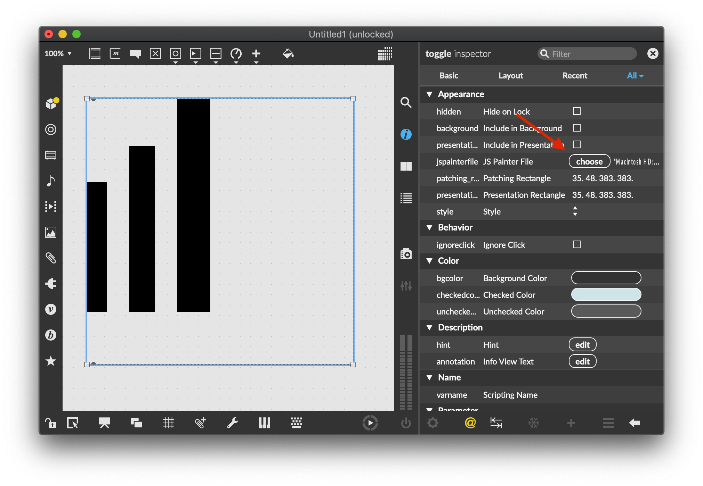

# Generating JavaScript from SVG, an Intro to Code Generation

This is a custom code generation tool, designed to translate SVG drawings into `jspainter` compatible JavaScript code. It lets you create custom UI objects for the [Max programming environment](https://cycling74.com/products/max).

## Running the code

```
npm run start -- -i input/01-input.svg -o out.js
```

Given an SVG file, this will generate a JavaScript file that works with `jspainter`. Back in Max, replace the `jspainterfile` attribute of any UI object with this file.



## Creating an SVG File

Any SVG editing application, like [Inkscape](https://inkscape.org/) or [Adobe Illustrator](https://www.adobe.com/products/illustrator.html), should be able to export to an SVG file. Just be aware that different applications might generate slightly different SVG files. In general, make sure that you export using settings that maximize compatiblility.
